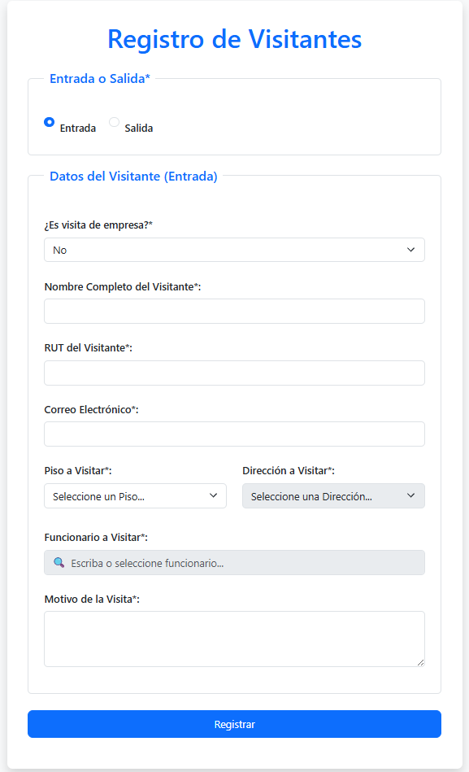
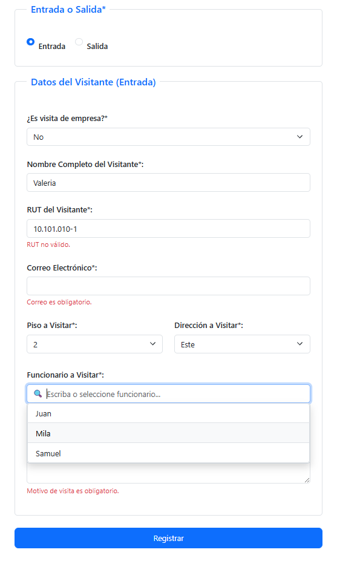
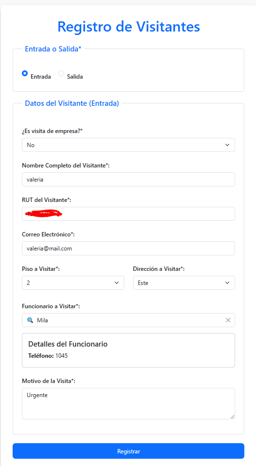
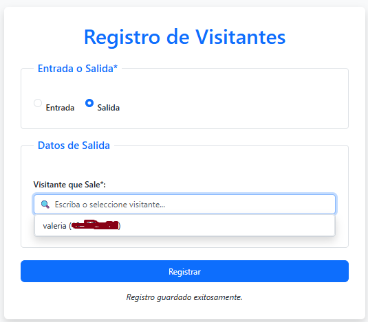
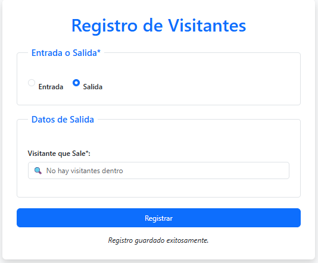

# 🏛️ Sistema de Registro de Visitantes — MOP

> Proyecto desarrollado durante práctica profesional en el **Ministerio de Obras Públicas (MOP)**, Región de Valparaíso.  
> Reemplaza el registro manual en papel por un sistema digital automatizado, operativo en producción.

---

## 📌 Descripción

El sistema digitaliza el control de visitas en las dependencias del edificio del MOP, permitiendo registrar entradas y salidas de visitantes en tiempo real. Fue construido íntegramente con herramientas gratuitas de Google (Apps Script + Google Sheets), sin costo de infraestructura y con acceso restringido por autenticación de Google.

Antes de este sistema, el registro se realizaba en formularios físicos en papel, lo que dificultaba la trazabilidad y el control de quién se encontraba dentro del edificio. Adicionalmente, los guardias debían buscar **manualmente en una lista** el número de teléfono del funcionario al que debían anunciar cada visita — un proceso lento y propenso a errores. El sistema automatiza esto: al seleccionar el funcionario, su teléfono aparece de forma inmediata en pantalla.

---

## ✨ Funcionalidades

- ✅ **Registro de Entrada**: Captura nombre, RUT, correo, piso, dirección, funcionario visitado y motivo de visita.
- ✅ **Registro de Salida**: Autocompletado inteligente que muestra solo los visitantes que están actualmente dentro del edificio.
- ✅ **Validación de RUT chileno** en tiempo real (formato y dígito verificador).
- ✅ **Selector en cascada**: Piso → Dirección → Funcionario, cargado dinámicamente desde la base de datos.
- ✅ **Autocompletado con buscador** para selección de funcionarios y visitantes.
- ✅ **Visitas de empresa**: Campo condicional para registrar el nombre de la empresa.
- ✅ **Control de acceso**: Solo el correo autorizado puede acceder al sistema.
- ✅ **Base de datos en vivo**: Todos los registros se almacenan en Google Sheets en tiempo real.
- ✅ **Historial consolidado**: Hoja "Visitas Consolidadas" con fecha, hora de entrada/salida, duración y datos del visitante.
- ✅ **Teléfono del funcionario automático**: Al seleccionar el funcionario a visitar, su número de teléfono aparece instantáneamente — antes los guardias debían buscarlo manualmente en una lista física.

---

## 📸 Capturas del sistema en funcionamiento

### Formulario de Entrada — vacío


### Formulario de Entrada — con autocompletado de funcionarios
> Al seleccionar Piso y Dirección, el buscador carga los funcionarios disponibles dinámicamente.



### Formulario de Entrada — completado
> Una vez seleccionado el funcionario, su **teléfono aparece automáticamente** en pantalla. Antes, el guardia tenía que buscarlo manualmente en una lista física uno por uno.



### Registro de Salida — selección de visitante
> El sistema muestra únicamente los visitantes que están **actualmente dentro del edificio**, evitando confusiones.



### Registro de Salida — sin visitantes dentro
> Cuando todos los visitantes ya salieron, el campo lo indica automáticamente.



---

## 🛠️ Tecnologías utilizadas

| Capa | Tecnología |
|---|---|
| Backend / Lógica | Google Apps Script (JavaScript) |
| Base de datos | Google Sheets |
| Frontend | HTML5 + CSS3 + Bootstrap 5 |
| Autenticación | Google Session (correo autorizado) |
| Despliegue | Google Apps Script Web App |

---

## 🗂️ Estructura del proyecto

```
sistema-registro-visitantes-mop/
│
├── src/
│   ├── Código.gs              # Lógica del servidor (backend en Apps Script)
│   ├── FormularioVisitas.html # Interfaz principal del formulario
│   └── Estilos.html           # Estilos CSS del formulario
│
├── docs/
│   └── capturas/              # Screenshots del sistema en funcionamiento
│
└── README.md
```

---

## ⚙️ Arquitectura del sistema

```
Usuario (Recepción)
       │
       ▼
  Google Apps Script Web App
  ┌────────────────────────────────┐
  │  doGet() → Valida sesión      │
  │           Google del usuario  │
  │                               │
  │  FormularioVisitas.html       │
  │  ├── Selector Piso            │
  │  ├── Selector Dirección       │
  │  ├── Buscador Funcionario     │
  │  └── Validación RUT chileno   │
  └────────────┬───────────────────┘
               │ google.script.run
               ▼
  Google Sheets (Base de Datos)
  ├── Hoja: Funcionarios
  ├── Hoja: Todos los registros
  └── Hoja: Visitas Consolidadas
```

---

## 🔐 Control de acceso

El sistema implementa autenticación mediante la sesión activa de Google del usuario. Solo el correo configurado como autorizado puede acceder al formulario; cualquier otro usuario ve una pantalla de "Acceso Denegado".

```javascript
// En Código.gs — configurar antes de desplegar
const CORREO_AUTORIZADO = "TU_CORREO@gmail.com";
```

---

## 🚀 Cómo desplegar

1. Abre [script.google.com](https://script.google.com) e inicia sesión con tu cuenta de Google.
2. Crea un nuevo proyecto de Apps Script.
3. Copia el contenido de `src/Código.gs` en el archivo `Código.gs` del proyecto.
4. Crea dos archivos HTML en el proyecto: `FormularioVisitas` y `Estilos`, y pega el contenido correspondiente.
5. Vincula el proyecto a una Google Spreadsheet con las siguientes hojas:
   - `Funcionarios` (columnas: ID, Nombre, Piso, Dirección, Teléfono)
   - `Todos los registros`
   - `Visitas Consolidadas`
6. Configura `CORREO_AUTORIZADO` con tu correo en `Código.gs`.
7. En el menú **Implementar → Nueva implementación**, selecciona tipo **Aplicación web**.
   - Ejecutar como: **Yo (tu cuenta)**
   - Quién tiene acceso: **Cualquier usuario de Google**
8. Copia la URL generada y compártela con el usuario autorizado.

---

## 📊 Estructura de la base de datos (Google Sheets)

### Hoja: `Funcionarios`
| ID | Nombre | Piso | Dirección | Teléfono |
|----|--------|------|-----------|----------|
| 1  | Juan Pérez | 3 | Dirección de Vialidad | +56 9 ... |

### Hoja: `Todos los registros`
| Fecha/Hora | Tipo Acción | Es Empresa | Nombre Empresa | Nombre Visitante | RUT | Correo | Piso | Dirección | ID Funcionario | Nombre Funcionario | Motivo | RUT Salida | Nombre Salida |
|---|---|---|---|---|---|---|---|---|---|---|---|---|---|

### Hoja: `Visitas Consolidadas`
| Fecha | Mes | Día Semana | Hora Entrada | Hora Salida | Duración | Nombre Visitante | RUT | Correo | Piso | Nombre Empresa |
|---|---|---|---|---|---|---|---|---|---|---|

---

## 🧠 Lo que aprendí / desafíos técnicos

- **Comunicación asíncrona** entre el frontend HTML y el backend Apps Script mediante `google.script.run`.
- **Validación de RUT chileno** implementada desde cero en JavaScript (algoritmo módulo 11).
- **Selectores en cascada** con carga dinámica de datos desde Google Sheets según la selección del usuario.
- **Autocompletado personalizado** sin librerías externas, con búsqueda en tiempo real sobre los datos cargados.
- **Control de estado de visitantes** en tiempo real: el sistema sabe quién está "dentro" según si tiene o no hora de salida registrada.
- **Restricción de acceso** sin un sistema de login tradicional, utilizando la sesión de Google como mecanismo de autenticación.

---

## 👨‍💻 Autor

**Isaac Serrano**  
Ingeniero en Informática — DUOC UC, Viña del Mar  
Práctica profesional realizada en el Ministerio de Obras Públicas (MOP), Región de Valparaíso.

[](https://www.linkedin.com/in/isaac-serrano99/)
[](mailto:isaac82015@gmail.com)

---

> *Este proyecto fue desarrollado con fines prácticos reales. Los datos mostrados en capturas de pantalla son ficticios o han sido anonimizados.*
